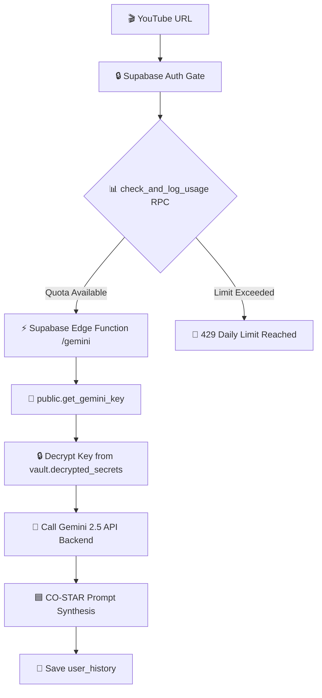

<p align="center">
  
</p>

<p align="center">
  <a href="/dashboard"></a>
  <a href="/history"></a>
  <a href="/settings"></a>
  <a href="/privacy"></a>
</p>

---

# PROMPTUBE

> A high-performance Bauhaus & Neo-Brutalist cognitive platform that synthesizes raw technical video data into modular, production-ready compiled instructions optimized for developer agents like **Cursor**, **Claude Code**, and **Gemini CLI**.

```bash
$ boot promptube

Loading Transcript Pipeline............. OK
Loading Knowledge Extraction Engine..... OK
Loading CO-STAR Compiler................ OK
Loading Telemetry Vault................. OK
Loading Kinetic Boot Sequence........... OK

SYSTEM STATUS: ONLINE
```

---

## 🧭 Navigation & Routes

Explore the Promptube ecosystem routes:
*   [🚀 Landing Console](file:///f:/prompt%20creater/src/app/page.tsx) (`/`) - System overview and pricing tier simulator.
*   [🛠️ Workspace Dashboard](file:///f:/prompt%20creater/src/app/dashboard/page.tsx) (`/dashboard`) - Interactive workspace to compile YouTube URLs and refine prompt configurations.
*   [📂 Archive Vault](file:///f:/prompt%20creater/src/app/history/page.tsx) (`/history`) - Dedicated history vault to batch, search, preview, and delete saved cognitive extractions.
*   [⚙️ Account Settings](file:///f:/prompt%20creater/src/app/settings/page.tsx) (`/settings`) - Adjust account parameters, toggle themes, and customize credentials.
*   [🗃️ Database Schema](file:///f:/prompt%20creater/schema.sql) (`schema.sql`) - Structured SQL configuration script for setting up Postgres dependencies.

---

## 📊 Interface Tier Levels (Free vs Pro)

Promptube features two distinct operating modes designed to fit different pipeline demands:

| Capability | Free Tier | Pro Tier |
| :--- | :--- | :--- |
| **Price** | `$0.00 / month` | `$5.98 / month` |
| **Daily Quota** | **3 extractions** per user per day | **50 extractions** per user per day |
| **AI Integration** | Offline Heuristic Fallback Engine | Secure Server-Side **Gemini 2.5 Pro & Flash** |
| **API Key Setup** | Requires manual Gemini API Key in Settings | Zero setup required; uses preconfigured cloud keys |
| **Synthesis Fidelity** | Standard Concept Mining | High-Fidelity CO-STAR XML Architectures |
| **Rate Throttling** | Standard Queue | Priority Threading (No delay) |

### Concurrency-Safe Quota Enforcer
Quota limits are verified **atomically** at the database level inside a transaction lock:
```sql
SELECT tier INTO v_tier FROM public.profiles WHERE id = p_user_id FOR UPDATE;
```
This isolates the transaction and performs a row-level write lock (`FOR UPDATE`), making limit verification **100% race-condition safe** when users invoke concurrent parallel API requests.

---

## 🏗️ Architecture



---

## ⚡ Core Engines

### 1. Unified Knowledge Extraction Engine
*   **Gemini 2.5 Pipeline**: Leverages server-side or secure client-side API integrations using `gemini-2.5-flash` and `gemini-2.5-pro`. It reads clean, token-minimized transcript slices to output deterministic JSON schemas detailing technical lessons, warning signals, and structural patterns.
*   **Heuristic Fallback**: If API quotas are saturated or keys are omitted, the heuristic engine processes the raw transcript client-side, isolating core concepts, warning verbs (`avoid`, `never`, `bad practice`), and technology keywords.

### 2. CO-STAR Prompt Engineering Compiler
Synthesizes telemetry maps from up to 3 separate target sources into a structured, modular prompt formatted to meet specific coding model profiles.
*   **Context**: Binds the target codebase configuration parameters and architecture frameworks.
*   **Objective**: Instructs on the specific prompt generation model rules (e.g. MVP scope, Feature Implementation, Bug Fixes).
*   **Style**: Tailors the system persona according to execution layer options (`ui-only`, `backend-only`, `fullstack`).
*   **Tone**: Formats professional, direct, analytical instruction layouts.
*   **Audience**: Modifies formatting conventions to match target tools (Cursor Composer multi-file flow, Claude Code terminal/lint execution loops, Windsurf Cascade reasoning, Lovable high-fidelity tokens).
*   **Response Format**: Structures deliverables explicitly via custom XML blocks to prevent code degradation or placeholder shortcuts.

### 3. Secure Credentials Storage (Supabase Vault)
To prevent exposing sensitive `GEMINI_API_KEY`s to the frontend, credentials are encrypted and stored in the database Vault using Authenticated Encryption with Associated Data (AEAD). The Edge Function retrieves this decrypted key securely at runtime via a custom postgres wrapper executing with elevated permissions (`SECURITY DEFINER`) only after verifying the user's active session token.

### 4. Dynamic Loading Screen & 404 Handlers
*   **Kinetic Loader**: An elegant, full-screen onboarding loader component greeting users with spinning Bauhaus geometric shapes, a retro progress indicator, and cascading log files. Features a minimum 1.8-second display rule to prevent page flashes and slides out cleanly with a translate transform animation.
*   **Interactive 404 Handler**: A custom, fully styled `not-found` page with a diagnostic error log console and clickable Bauhaus vectors (red square, yellow circle, blue triangle) that rotate and bounce interactively using GSAP.

---

## 🛠️ Tech Stack

- **Framework**: Next.js 16 (App Router) & React 19
- **Database & Auth**: Supabase client adapters & PostgreSQL
- **Backend API routing**: Supabase Edge Functions (Deno Runtime)
- **AI Models**: Google Gemini 2.5 API (Pro & Flash)
- **Aesthetic**: Bauhaus / Neo-Brutalist Design Tokens
- **Animations**: Custom GSAP interactive transition engines

---

## ⚡ Quick Start

1. **Install Dependencies**:
   ```bash
   npm install
   ```
2. **Configure Database**:
   Execute the [schema.sql](file:///f:/prompt%20creater/schema.sql) script in your Supabase SQL Editor.
3. **Set Environment Keys** (in `.env.local`):
   ```env
   NEXT_PUBLIC_SUPABASE_URL=YOUR_SUPABASE_URL
   NEXT_PUBLIC_SUPABASE_ANON_KEY=YOUR_SUPABASE_ANON_KEY
   GEMINI_API_KEY=YOUR_GEMINI_API_KEY
   ```
4. **Boot Engine**:
   ```bash
   npm run dev
   ```
   Open [http://localhost:3000](http://localhost:3000) in your browser.

---

## 🗺️ Roadmap

```text
[████████░░] Multi-Source Fusion
[██████░░░░] Prompt Benchmarking
[█████░░░░░] AI Workspace Memory
[████░░░░░░] Autonomous Research Agents
```

<details>
<summary>⚠ Internal Diagnostic Console</summary>

```bash
$ diagnostics

CPU STATUS ............... STABLE
SYNTHESIS CORE ........... ACTIVE

WARNING:
Building cool things may become addictive.
```
</details>
