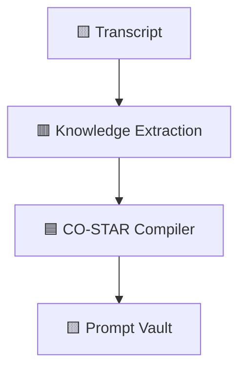

<p align="center">
  
</p>

<p align="center">


</p>

# PROMPTUBE

> The Bauhaus OS for Digital Synthesis

```bash
$ boot promptube

Loading Transcript Pipeline............. OK
Loading Knowledge Extraction Engine..... OK
Loading CO-STAR Compiler................ OK
Loading Telemetry Vault................. OK

SYSTEM STATUS: ONLINE
```

## Mission

Transform raw technical video content into structured, executable intelligence for AI coding agents.

---

## Control Center

```text
┌──────────────────────────────────────┐
│        DIGITAL SYNTHESIS CORE        │
├──────────────────────────────────────┤
│ Transcript Engine         ● ONLINE   │
│ Knowledge Extraction      ● ONLINE   │
│ CO-STAR Compiler          ● ONLINE   │
│ Prompt Synthesis          ● ONLINE   │
│ Telemetry Vault           ● ONLINE   │
└──────────────────────────────────────┘
```

## Architecture



## Core Engines

### 1. Unified Knowledge Extraction Engine
*   **Gemini 2.5 Pipeline**: Leverages server-side or secure client-side API integrations using `gemini-2.5-flash` and `gemini-2.5-pro`. It reads clean, token-minimized transcript slices to output deterministic JSON schemas detailing technical lessons, warning signals, and structural patterns.
*   **Deterministic Heuristic Fallback**: An offline parser equipped with semantic scan libraries. If API quotas are saturated or keys are omitted, the heuristic engine processes the raw transcript client-side, isolating core concepts, warning verbs (`avoid`, `never`, `bad practice`), and technology keywords.

### 2. CO-STAR Prompt Engineering Compiler
Synthesizes telemetry maps from up to 3 separate target sources into a structured, modular prompt formatted to meet specific coding model profiles.
*   **Context**: Binds the target codebase configuration parameters and architecture frameworks.
*   **Objective**: Instructs on the specific prompt generation model rules (e.g. MVP scope, Feature Implementation, Bug Fixes).
*   **Style**: Tailors the system persona according to execution layer options (`ui-only`, `backend-only`, `fullstack`).
*   **Tone**: Formats professional, direct, analytical instruction layouts.
*   **Audience**: Modifies formatting conventions to match target tools (Cursor Composer multi-file flow, Claude Code terminal/lint execution loops, Windsurf Cascade reasoning, Lovable high-fidelity tokens).
*   **Response Format**: Structures deliverables explicitly via custom XML blocks to prevent code degradation or placeholder shortcuts.

### 3. Vault & Telemetry Synchronization
*   Secure token authentication powered by **Supabase Auth**.
*   Synchronized telemetry history using standard **PostgreSQL** architectures.
*   Strict client isolation governed by PostgreSQL **Row-Level Security (RLS)** policy gates.

---

## Demo

```bash
$ ingest youtube-video

✓ Main Topic Identified
✓ Core Principles Extracted
✓ Lessons Mapped
✓ Warnings Detected

Compiling CO-STAR Prompt...

✓ Prompt Generated
```

## Tech Stack

- **Framework**: Next.js 16 (App Router) & React 19
- **Language**: Strict TypeScript 5
- **Design Paradigm**: Bauhaus / Neo-Brutalist design tokens. Employs strong `#ffcc00` (Yellow), `#e63b2e` (Red), and `#0055ff` (Blue) accents, thick black border strokes, heavy geometric dropdown cards, and responsive custom grid layouts.
- **Database & Security**: Supabase client adapters managing secure user-vault syncing.
- **AI Models**: Google Gemini 2.5 API
- **Animations**: Custom GSAP interactive transition models

---

## Installation & Database Configuration

### 1. Clone & Core Dependencies Installation
Install dependencies cleanly using the package manifest:
```bash
npm install
```

### 2. Telemetry Vault Schema Configuration
If running your own Supabase cluster, navigate to the **SQL Editor** in your Supabase Dashboard and execute the SQL script in `schema.sql` to set up the relational database tables, index allocations, and Row-Level Security policy boundaries:
```sql
-- 1. Create table for storing structured knowledge history
CREATE TABLE IF NOT EXISTS public.user_history (
    id UUID DEFAULT gen_random_uuid() PRIMARY KEY,
    user_id UUID NOT NULL REFERENCES auth.users(id) ON DELETE CASCADE,
    video_id TEXT NOT NULL,
    video_title TEXT NOT NULL,
    thumbnail_url TEXT NOT NULL,
    channel_name TEXT,
    main_topic TEXT NOT NULL,
    principles TEXT[] NOT NULL DEFAULT '{}',
    lessons TEXT[] NOT NULL DEFAULT '{}',
    warnings TEXT[] NOT NULL DEFAULT '{}',
    examples TEXT[] NOT NULL DEFAULT '{}',
    frameworks TEXT[] NOT NULL DEFAULT '{}',
    tags TEXT[] NOT NULL DEFAULT '{}',
    transcript_text TEXT NOT NULL,
    created_at TIMESTAMPTZ NOT NULL DEFAULT now(),
    
    UNIQUE (user_id, video_id)
);

-- 2. Enable Row Level Security (RLS)
ALTER TABLE public.user_history ENABLE ROW LEVEL SECURITY;

-- 3. Create policies so users can only access their own history data
CREATE POLICY "Users can view their own history" ON public.user_history FOR SELECT USING (auth.uid() = user_id);
CREATE POLICY "Users can insert their own history" ON public.user_history FOR INSERT WITH CHECK (auth.uid() = user_id);
CREATE POLICY "Users can update their own history" ON public.user_history FOR UPDATE USING (auth.uid() = user_id);
CREATE POLICY "Users can delete their own history" ON public.user_history FOR DELETE USING (auth.uid() = user_id);
```

### 3. Environment Workspace Bindings
Configure your local environment variables in your `.env.local` file at the root directory:
```env
NEXT_PUBLIC_SUPABASE_URL=YOUR_SUPABASE_URL
NEXT_PUBLIC_SUPABASE_ANON_KEY=YOUR_SUPABASE_ANON_KEY
GEMINI_API_KEY=YOUR_GEMINI_API_KEY
```

### 4. Running the Development Workstation
Execute the Next.js development compilation pipeline:
```bash
npm run dev
```
Open [http://localhost:3000](http://localhost:3000) in your browser.

---

## Roadmap

```text
[████████░░] Multi-Source Fusion
[██████░░░░] Prompt Benchmarking
[█████░░░░░] AI Workspace Memory
[████░░░░░░] Autonomous Research Agents
```

<details>
<summary>⚠ Internal Diagnostic Console</summary>

```bash
$ diagnostics

CPU STATUS ............... STABLE
SYNTHESIS CORE ........... ACTIVE

WARNING:
Building cool things may become addictive.
```
</details>
